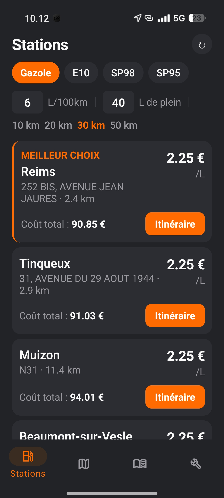
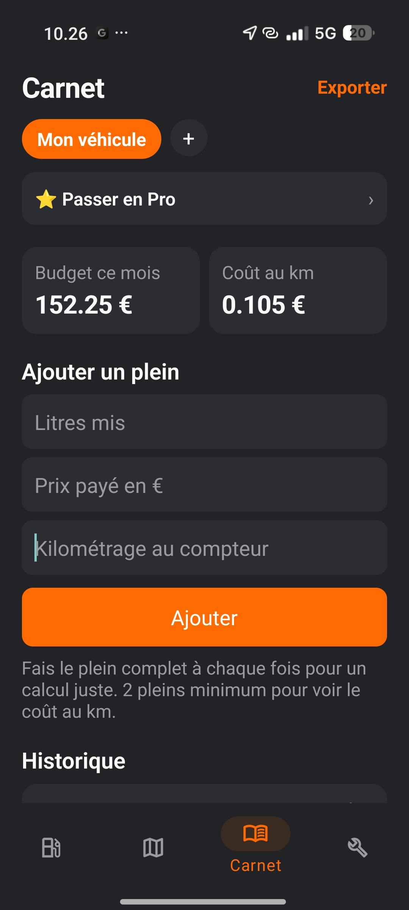

# Le Bon Plein 🚗⛽

Application mobile qui aide les conducteurs (particuliers, livreurs, VTC) à trouver les stations-service les moins chères autour d'eux et à suivre leurs dépenses de carburant.

## Fonctionnalités

- **Stations** : recherche des stations-service à proximité par géolocalisation, filtrées par type de carburant, avec le prix affiché pour chacune
- **Carte** : visualisation des stations sur une carte plein écran, avec accès direct à l'itinéraire (Google Maps / Waze / Plans)
- **Calcul de coût** : estimation du coût total d'un plein en fonction du trajet et de la consommation du véhicule
- **Carnet de pleins** : historique des pleins effectués, export possible au format CSV
- **Multi-véhicules** : gestion de plusieurs véhicules avec leurs propres réglages
- **Entretien** : rappels d'entretien basés sur le kilométrage
- **Réglages personnalisés** : carburant préféré, consommation, rayon de recherche, mémorisés entre les sessions

## Technologies utilisées

- **React Native** avec **Expo**
- **TypeScript**
- Géolocalisation native
- Stockage local des données (hors ligne)

## Aperçu

 

## Contexte du projet

Projet personnel développé pour approfondir React Native et Expo, autour d'une vraie problématique : trouver rapidement la station la moins chère et suivre ses dépenses de carburant.

## Licence

MIT
